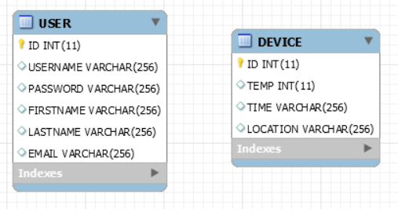
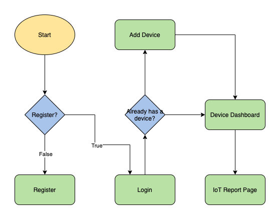
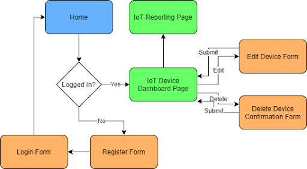
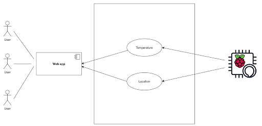
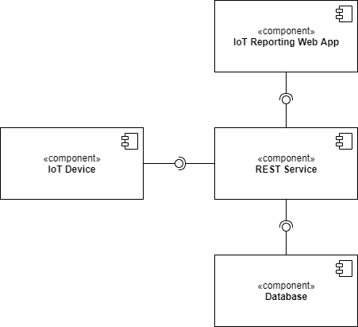
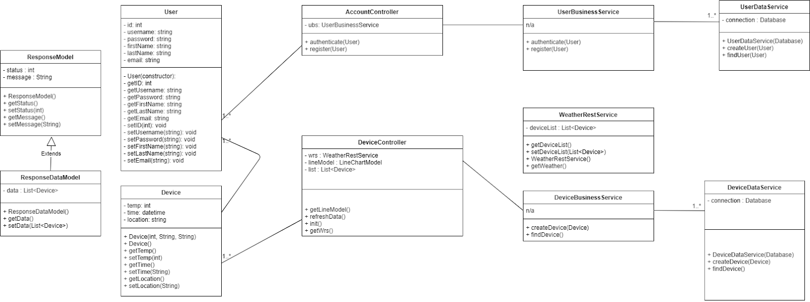
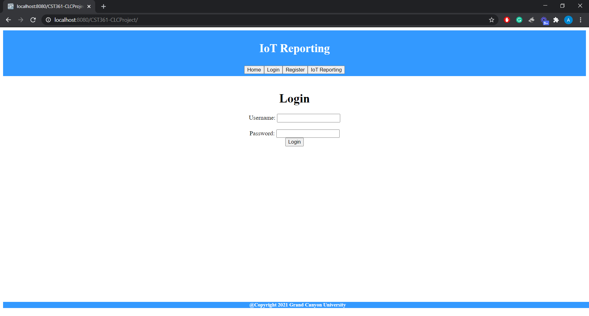
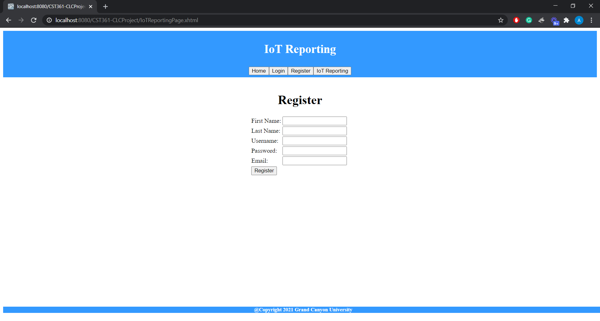
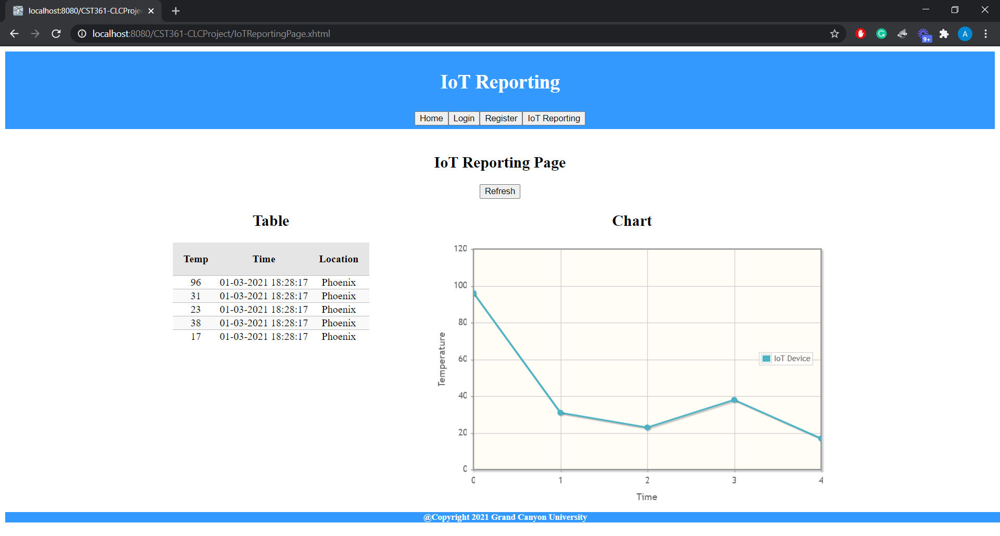

# Windspeed Monitor Device

 Develop IoT weather tracking device reports to a web application using Java EE framework with implementation of RESTful service and MySQL. </>p

# ER diagram:

# Flow Chart:

# Sitemap:

# UML Usecase Diagram:

# UML Component Diagram

# UML Class Diagram

# Login Page

# Register Page

# Device Information Display Diagram

